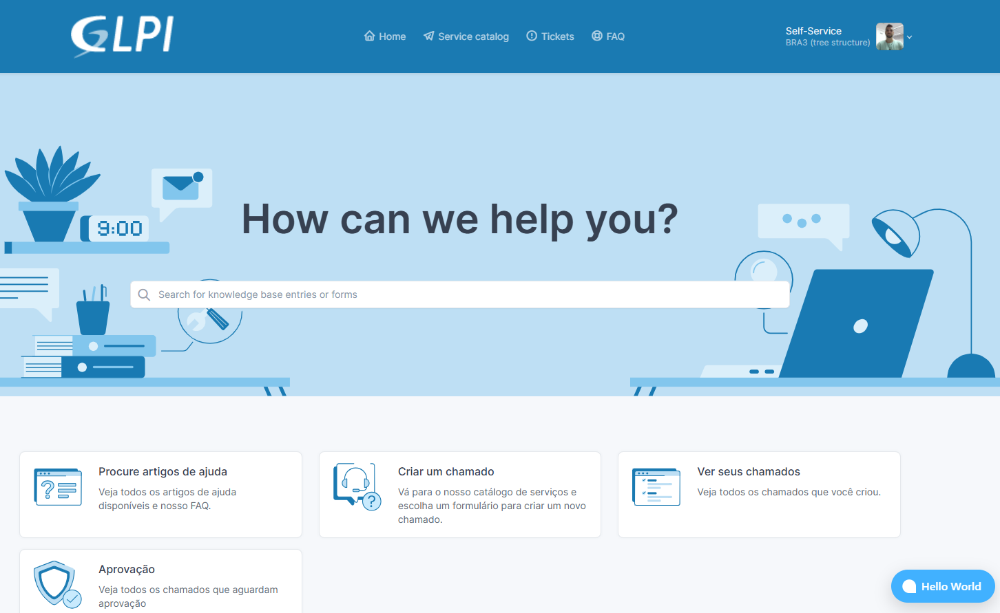
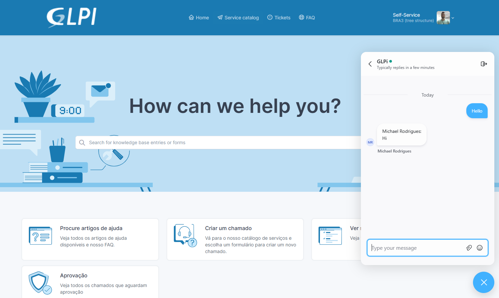
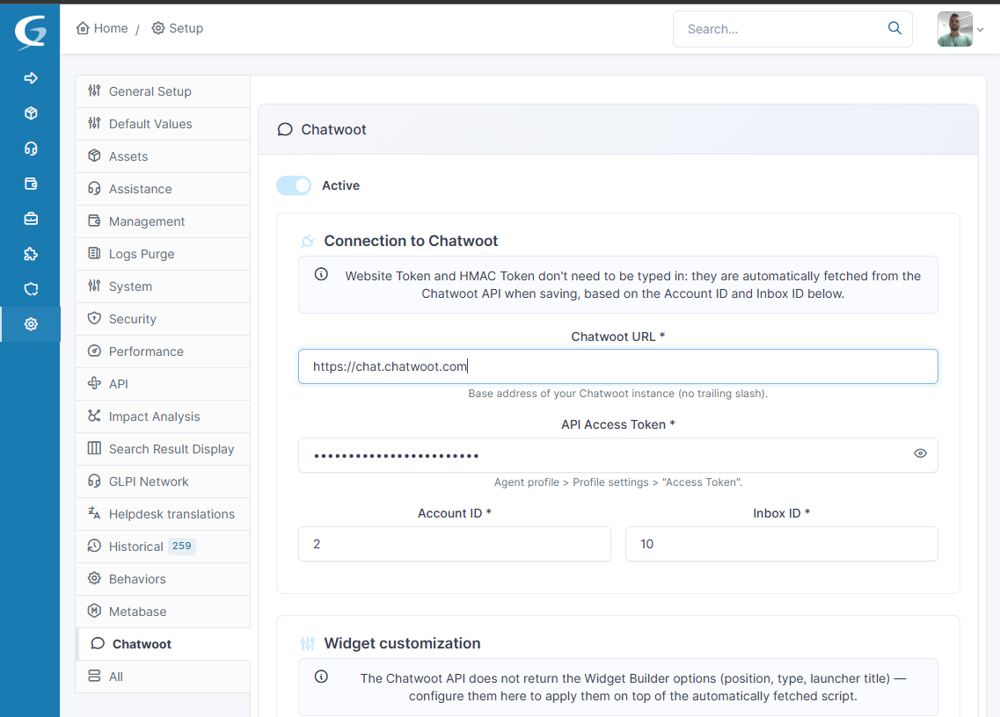
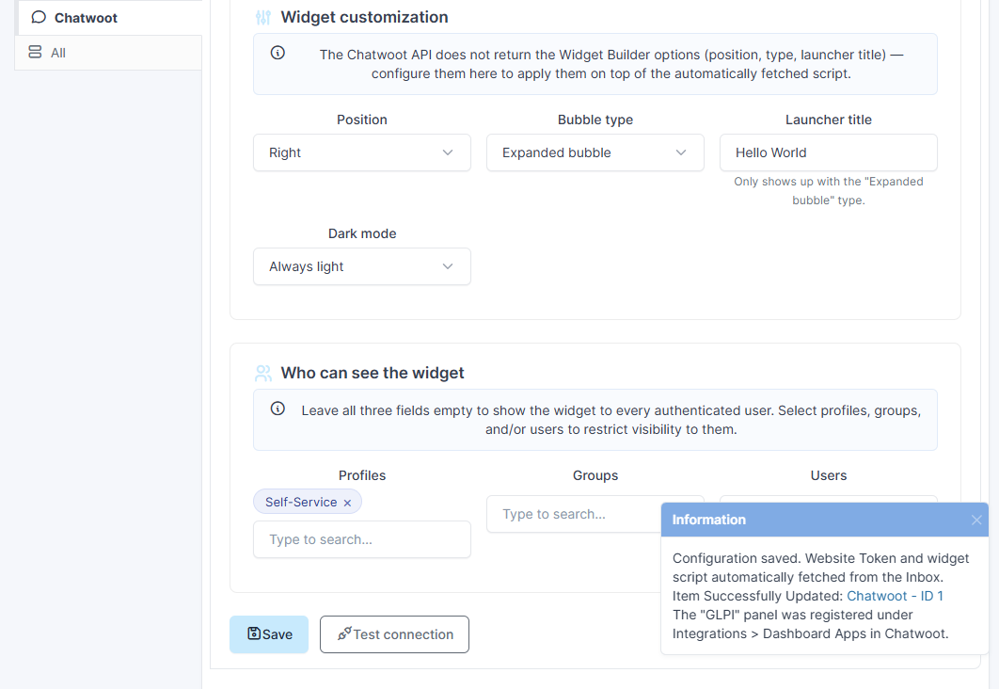
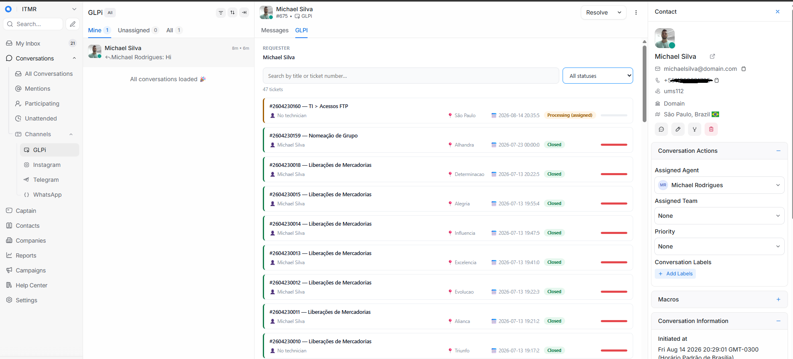
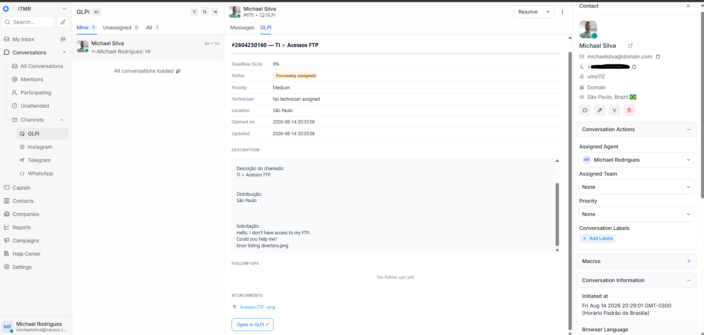

<p align="center">
  
</p>

<h1 align="center">Chatwoot for GLPI</h1>

<p align="center">
  A live chat widget inside GLPI, and a ticket panel inside Chatwoot — so support agents and
  requesters never have to leave the tool they're already in.
</p>

<p align="center">
  <a href="LICENSE"></a>
  
  
  
</p>

---

Full integration of [Chatwoot](https://www.chatwoot.com/) with [GLPI](https://glpi-project.org/)
11.x: a chat widget on authenticated pages, automatic user identification, and a panel inside
Chatwoot itself showing the tickets of the person you're chatting with — no need to switch screens.

## Screenshots

**In GLPI** — the widget appears on every authenticated page, ready to chat.

| Widget bubble on the GLPI portal | Conversation open, message sent and answered |
|---|---|
|  |  |

**Configuration** — Setup > General > Chatwoot, no manual token copy/pasting.

| Connection settings | Customization, permissions, and the panel auto-registered in Chatwoot |
|---|---|
|  |  |

**Inside Chatwoot** — the "GLPI" tab, right next to "Messages".

| Requester's ticket list | Full ticket detail, without leaving the conversation |
|---|---|
|  |  |

## Table of contents

- [What the plugin does](#what-the-plugin-does)
- [Languages](#languages)
- [Requirements](#requirements)
- [Installation](#installation)
- [Configuration](#configuration)
- [The "GLPI" panel inside Chatwoot](#the-glpi-panel-inside-chatwoot)
- [Security](#security)
- [Architecture and file structure](#architecture-and-file-structure)
- [License](#license)

## What the plugin does

### 💬 Chatwoot widget in GLPI

- Injects the official Chatwoot widget into every authenticated GLPI page.
- **Minimal configuration**: only asks for the Chatwoot URL, API Access Token, Account ID, and Inbox
  ID — the **Website Token and HMAC Token are fetched automatically** from the Chatwoot API, no
  copy/pasting needed.
- **Always up to date with Chatwoot**: instead of rebuilding the widget-loading logic by hand, the
  plugin literally uses the official embed script returned by the Chatwoot API for that Inbox. If
  Chatwoot changes the embed format in the future, it arrives automatically on the next sync.
- **Automatic sync**: an automatic action (GLPI Automatic actions) runs hourly fetching the latest
  Website Token/HMAC Token/embed script — if a token gets regenerated or the Inbox recreated on
  Chatwoot's side, the widget doesn't stay broken waiting for someone to notice and save manually.
  The **Test connection** button runs the same sync on the spot.
- Customization: position (left/right), bubble type (standard/expanded), launcher title, and dark
  mode (automatic based on the system / always light / always dark).

### 🪪 User identification

- Calls `$chatwoot.setUser()` with the logged-in GLPI user's name, email, phone (normalized to the
  format Chatwoot expects), and profile photo.
- **`identifier_hash`** (Identity Validation / HMAC): uses the Inbox's HMAC Token to prove to
  Chatwoot the identity wasn't forged — makes the "identity not verified" warning go away.
- **Identifier = GLPI username** (login), not an artificial value — makes it easy to recognize the
  contact in Chatwoot.
- **City and country**: fetched from the user's Location → Entity (with fallback), and synced via
  the Chatwoot REST API right after `setUser()` — works around a known Chatwoot SDK bug where these
  fields sometimes don't persist on the contact record when sent only through `setUser()`.
- **Profile photo**: served by its own proxy protected by a signed token (Chatwoot's dashboard runs
  on their domain, without a GLPI session, so a regular URL wouldn't work).

### 🔒 Visibility permissions

- Choose **which Profiles, Groups, and/or Users** can see the widget. Leaving everything blank, the
  widget shows up for every authenticated user (default).
- Self-contained search pickers (first 10 results + filter by name as you type), no external
  libraries required.

### 🎫 "GLPI" panel inside Chatwoot (Dashboard App)

- **Automatically registered** under Integrations > Dashboard Apps in Chatwoot when the
  configuration is saved — no need to set it up manually.
- Shows the **tickets of the person identified in the conversation** (as requester): search by
  title/number (directly in GLPI, not just what's already loaded), status filter, assigned
  technician, location, and an **SLA progress bar** based on GLPI's real deadline (`time_to_resolve`).
- Clicking a ticket shows the **full detail inside the panel itself** (without leaving Chatwoot):
  status, priority, technician, location, description (with embedded images shown as thumbnails),
  the **full timeline** (follow-ups from both sides + solution, with the channel — walk-in/email/etc
  — and internal notes flagged), and the list of **downloadable attachments**. A "← Back" button
  returns to the list, and "Open in GLPI ↗" opens the full page in a new tab.
- If the conversation's identifier doesn't match any GLPI user, the plugin tries again by **phone**
  (checking Phone, Mobile phone, and Phone 2, normalizing both sides to compare only the digits).

## Languages

| | |
|---|---|
| **Configuration screen** | GLPI's standard gettext (`locales/*.po`/`*.mo`) — **en_GB**, **en_US**, and **pt_BR** included. Follows each GLPI account's own configured language automatically. |
| **"GLPI" panel inside Chatwoot** | Its own plain JSON translations (`public/dashboard_app/locales/`) — **en** and **pt_BR**. 100% automatic, driven by the **Chatwoot account's** configured language, never GLPI's. |

The panel's language even applies to values that come from GLPI itself (ticket status, priority,
solution status) — the panel tells GLPI which language to answer in, for that one request only,
without touching anyone's real session.

<details>
<summary>How the panel's language detection works, and how to add another language</summary>

**Detection**: `Config::getAccountLocale()` fetches the account's language server-side via
`GET /api/v1/accounts/{account_id}` (confirmed response shape:
`{"locale": "en", "id": 2, "name": "...", ...}`), and `dashboard_app.php` renders the whole page in
that language from the very first byte — nothing swaps client-side after load. This is account-wide
(shared by everyone in the account), not a specific agent's own preference, since there's no
reliable, documented way to read an individual agent's language from inside the panel. Falls back to
English if the account's language can't be determined.

**GLPI-sourced values** (ticket status/priority/solution labels) follow along too: the panel sends
`lang=en`/`lang=pt_BR` with every request to `dashboard_tickets.php` and `dashboard_ticket_detail.php`,
which call `Config::applyRequestLanguage()` — a thin wrapper around GLPI's own
`Session::loadLanguage()` that switches gettext for that single request only. These public endpoints
never had an authenticated session to begin with, so nothing leaks into anyone's normal GLPI usage.

**Adding a language to the configuration screen** (gettext): copy `locales/chatwoot.pot` to
`locales/{code}.po` (e.g. `es_ES.po`), translate the `msgstr` entries, compile with
`msgfmt {code}.po -o {code}.mo`.

**Adding a language to the panel** (JSON): add a file under `public/dashboard_app/locales/` (e.g.
`es.json`) with the same keys as `en.json`; read it in `dashboard_app.php` and add it to the
`$dicts_json` array; add the matching case to the language checks in `dashboard_app.js` (today
hardcoded to just `en`/`pt_BR`).

</details>

## Requirements

| | |
|---|---|
| **GLPI** | 11.x only — see note below |
| **PHP** | 8.1+ |
| **Chatwoot** | Self-hosted or cloud, with a Website-type Inbox configured |
| **Chatwoot API Access Token** | From an agent with access to the Inbox (Agent profile > Profile settings > Access Token) |

> **Why GLPI 11 only?** Earlier development versions attempted GLPI 10.x support, but GLPI 10 uses a
> fundamentally different bootstrap/routing model (e.g. requires `inc/includes.php` in every script,
> has no `public/` asset convention, and has no equivalent of the `Firewall`/`SessionManager` APIs
> the Dashboard App panel depends on to work without a login session). Supporting both would mean
> maintaining two different plugin architectures in parallel, so this plugin officially targets GLPI
> 11.x only — `plugin_chatwoot_check_prerequisites()` blocks installation on older versions instead
> of failing partway through.

## Installation

1. Copy the `chatwoot/` folder into `marketplace/` (or `plugins/`) at the root of your GLPI
   installation.
2. Under **Setup > Plugins**, install and enable the "Chatwoot" plugin.
3. Go to **Setup > General > Chatwoot**.

## Configuration

Fill in:

| Field | Required | Where to find it in Chatwoot |
|---|---|---|
| Chatwoot URL | Yes | Your instance's address (e.g. `https://chat.yourcompany.com`) |
| API Access Token | Yes | Agent profile > Profile settings > Access Token |
| Account ID | Yes | Chatwoot dashboard URL (`/app/accounts/{id}/...`) |
| Inbox ID | Yes | Inbox settings in Chatwoot |

Website Token and HMAC Token **don't need to be typed in** — they're fetched automatically when
saving, based on the Account ID and Inbox ID. Use the **Test connection** button to validate
everything before saving.

Then adjust **Widget customization** and, if you want to restrict who sees the widget, configure
**Permissions**.

## The "GLPI" panel inside Chatwoot

After successfully saving the configuration for the first time, open any conversation in Chatwoot —
a **"GLPI"** tab should appear next to "Conversation". If it doesn't show up, check under
Integrations > Dashboard Apps whether "GLPI" was created; if not, save the configuration again.

## Security

- **API Access Token and HMAC Token** are encrypted with GLPI's own `GLPIKey` class (the same one
  used for LDAP/SMTP passwords) and automatically re-encrypted whenever the administrator runs
  `php bin/console security:change_key` (registered via `Hooks::SECURED_FIELDS`). Neither is ever
  sent to the browser.
- The panel inside Chatwoot (profile photo, ticket list, detail, attachments) runs in an iframe on
  Chatwoot's domain, where the GLPI session cookie is normally not sent (modern browsers block
  third-party cookies in iframes). That's why these endpoints are public
  (`Firewall::STRATEGY_NO_CHECK` + `SessionManager::registerPluginStatelessPath`), but protected by
  an automatically generated **unique integration token** — and every query checks again that the
  requested data (ticket, document, photo) really belongs to the person identified in that specific
  conversation, never a free search for any data in the system.
- Ticket descriptions and messages are converted from HTML to plain text on the server and inserted
  via `textContent` in the browser (never `innerHTML`), avoiding any risk of reproducing HTML/script
  from old content.
- Attachment and embedded image downloads go through a proxy that validates the document's ownership
  (directly on the ticket, or linked to one of its follow-ups/solution) before serving any byte.

## Architecture and file structure

<details>
<summary>Expand file tree</summary>

```
chatwoot/
├── setup.php                       Plugin metadata, hooks, public route registration
├── hook.php                        Install/uninstall, migrations, automatic action
├── src/
│   └── Config.php                  All the logic: connection, widget, permissions, tickets
├── templates/
│   └── config.html.twig            Configuration screen (Setup > General > Chatwoot)
├── front/
│   ├── config.php                  Displays the configuration tab
│   └── config.form.php             Saves the configuration
├── ajax/
│   ├── test.php                    "Test connection" button
│   ├── search_targets.php          Profile/Group/User search for the permissions screen
│   └── sync_contact.php            Syncs city/country via the REST API after setUser()
├── public/                         Scripts/assets accessed directly by the browser (GLPI 11)
│   ├── js/chatwoot.js.php          Loads and identifies the widget on every GLPI page
│   ├── css/chatwoot.css            Styles for the configuration screen
│   ├── avatar.php                  Profile photo proxy for Chatwoot's native contact card (signed token)
│   └── dashboard_app/              Everything for the "GLPI" panel shown inside Chatwoot
│       ├── dashboard_app.php       HTML shell (resolves the account's Chatwoot language server-side)
│       ├── css/dashboard_app.css   Panel styles
│       ├── js/dashboard_app.js     Panel logic
│       ├── dashboard_tickets.php       Ticket list (JSON)
│       ├── dashboard_ticket_detail.php Ticket detail, with timeline and attachments (JSON)
│       ├── dashboard_document.php      Attachment/embedded image download proxy
│       └── locales/                Plain JSON translations for this panel only (en.json, pt_BR.json)
├── locales/                        GLPI-side gettext translations: chatwoot.pot, en_GB.po/.mo, pt_BR.po/.mo
├── pics/
│   └── logo.png                    Plugin logo (marketplace catalog listing)
├── screenshots/                    Images used in the "Screenshots" section above
├── LICENSE
├── CHANGELOG.md
└── README.md
```

</details>

The `glpi_plugin_chatwoot_configs` table stores the configuration; `glpi_plugin_chatwoot_targets`
stores the permissions (profiles/groups/users authorized to see the widget).

## License

[AGPL-3.0-or-later](LICENSE) (AGPLv3+).

## Author

**Michael Rodrigues** — [github.com/MichaelRodriguesOficial](https://github.com/MichaelRodriguesOficial)
